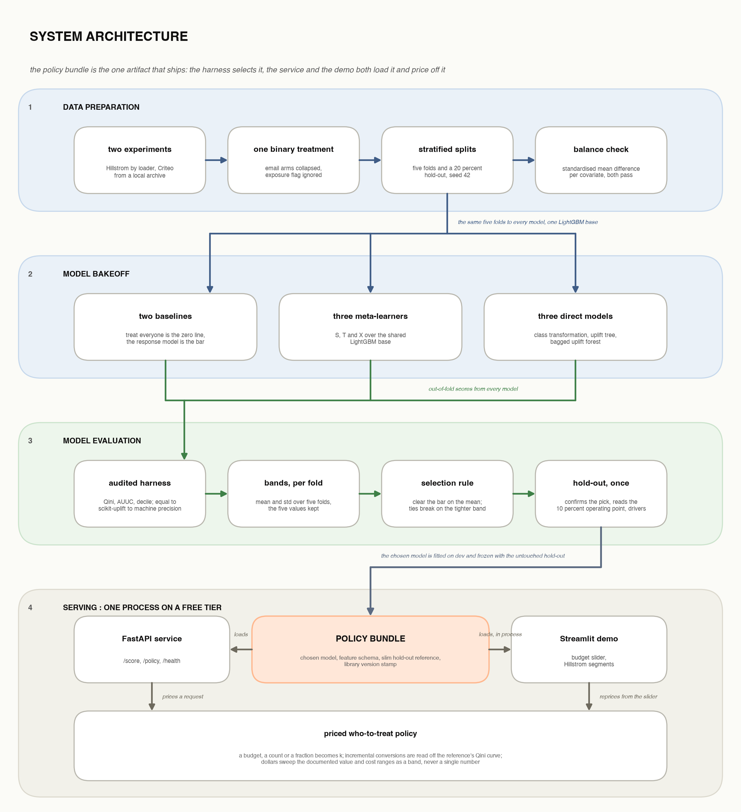

# Uplift Targeting

**Estimate the incremental effect of a treatment per customer, rank people by it,
and turn that into a budgeted targeting policy with a dollar value attached.** It is
decision science, not prediction: a churn model tells you who will leave, not who
stays *because* you intervened. Those are different people, and the gap between them
is where the budget goes. This project lives in that gap.

[](https://github.com/i-hridaysaha/uplift-targeting/actions/workflows/ci.yml)


📄 **Case study:** [hridaysaha.com/projects/uplift-targeting](https://www.hridaysaha.com/projects/uplift-targeting)
🔗 **Live demo:** [uplift-targeting.streamlit.app](https://uplift-targeting-zpatkwkjfwqvnqdxpu9rzc.streamlit.app/)


## Results

The project is a bakeoff with an honest scoreboard, and the result is the kind
rarely written down: **uplift's edge over "just target whoever is most likely to
respond" is slim and dataset-dependent. On 64k customers it does not exist; on a
million rows it sits inside the noise; on all fourteen million Criteo rows it
resolves, at about four to six percent of the baseline's Qini.**

> **Data note.** Both datasets are public, randomized, and **anonymized** ad/
> marketing data. The deliverable is the pipeline and the honest evaluation, not the
> absolute numbers — they speak only to these exact treatments and populations.

Primary outcome is **visit**. Scores are out-of-fold from 5-fold stratified CV
(seed 42); the headline is normalized Qini (0–1, higher is better) as **mean ± std
across folds** — the std is the honest unit, not a decoration. The **hold-out**
column is a single unbiased number on the reserved 20% split, scored once per model
to confirm the pick; it never sets the headline.

### Criteo (scale case, 1M subsample)

| Model | Qini (5-fold CV) | Qini (hold-out) |
|---|---|---|
| treat_everyone | +0.0000 ± 0.0000 | +0.0000 |
| response_model *(baseline)* | +0.0877 ± 0.0074 | **+0.0973** |
| s_learner | +0.0927 ± 0.0110 | +0.0806 |
| t_learner | +0.0703 ± 0.0168 | +0.0626 |
| x_learner | +0.0729 ± 0.0145 | +0.0518 |
| class_transformation | +0.0776 ± 0.0049 | +0.0810 |
| uplift_tree | +0.0784 ± 0.0055 | +0.0876 |
| **uplift_forest** *(chosen)* | **+0.0905 ± 0.0067** | +0.0936 |

Only the s_learner and the uplift_forest clear the response bar (+0.0877) on the CV
mean, and their bands overlap — a statistical tie. The rule breaks it on stability
(the forest's band is tighter), and the hold-out confirms the pick: the forest holds
at +0.0936 where the s_learner falls to +0.0806. The forest's own margin over the bar
(0.0028) sits inside both bands, and the baseline leads the single hold-out draw, so
the honest reading is "draws level at scale", not "beats".

More draws say the same, and less kindly to the tie-break: re-splitting the dev rows
under three more seeds (`scripts/phase8_repeated_cv.py`, 20 folds in all) leaves the
forest at +0.0889 ± 0.0081 against the baseline's +0.0876 ± 0.0055 (13 of 20 folds)
and the s_learner at +0.0922 ± 0.0099, which leads the forest on 14 of 20 folds. Read
as paired tests on the five seed-42 folds (`scripts/phase8_paired_folds.py`), no pair
separates (p between 0.36 and 0.51). The forest ships on the strength of the 200,000-row
hold-out, where the s_learner collapsed; the band-width argument alone would not carry it.

### Criteo, all 13,979,592 rows (the scale check)

The same protocol on the whole file (`scripts/phase8_full_criteo.py`, three models,
11.2M development rows, 2.8M hold-out; balance still passes, worst |SMD| 0.049):

| Model | Qini (5-fold CV) | Qini (hold-out) | Folds above the bar |
|---|---|---|---|
| response_model *(baseline)* | +0.0846 ± 0.0013 | +0.0844 | — |
| s_learner | +0.0899 ± 0.0021 | +0.0893 | 5 of 5 |
| **uplift_forest** | +0.0881 ± 0.0016 | +0.0887 | 5 of 5 |

Fourteen times the rows shrink the bands about five-fold, and the picture resolves:
both uplift models clear the baseline on every fold (paired t, p < 0.001 for each)
and on the hold-out, by +0.0035 (forest) and +0.0053 (s_learner). The edge is small,
four to six percent of the baseline's Qini, but it is no longer inside the noise.
The s_learner against the forest is still a tie (gap 0.0018, p 0.07); the rule
re-applied returns the forest on the tighter band. The full field, the shipped bundle
and the demo remain on the one-million-row subsample.

### Hillstrom (readable case, 64k customers)

| Model | Qini (5-fold CV) | Qini (hold-out) |
|---|---|---|
| treat_everyone | +0.0000 ± 0.0000 | +0.0000 |
| **response_model** *(chosen)* | **+0.0197 ± 0.0170** | +0.0187 |
| s_learner | +0.0088 ± 0.0174 | +0.0410 |
| t_learner | +0.0134 ± 0.0214 | +0.0282 |
| x_learner | +0.0085 ± 0.0168 | +0.0505 |
| class_transformation | +0.0061 ± 0.0167 | +0.0469 |
| uplift_tree | +0.0017 ± 0.0221 | +0.0417 |
| uplift_forest | +0.0129 ± 0.0155 | +0.0661 |

No uplift model clears the response bar on CV, and every one has **std > mean** —
indistinguishable from zero, and from the baseline, whose own band overlaps all of
them. Twenty folds across four seeds agree: the baseline leads the forest on 14 of 20
and the s_learner on 13 of 20. The rule defaults to the cheapest model when nothing is
distinguishable, so the chosen model here is the response baseline, labeled openly as a
**negative result**.
The single hold-out draw disagrees (every uplift model swings above the baseline; at
the top 10% the forest's decile carries +0.151 visit uplift against the baseline's
+0.074, standard errors about 0.02), and that disagreement is recorded as the reason
to want more data, not resolved by picking the draw one prefers. A model that quietly
loses to a baseline, dressed up as a win, is the failure mode this project is built
to avoid; so is a draw that quietly overturns a band.

<p align="center">
  
  
</p>

### From uplift to a priced policy

Ranking is half the job. The value machinery turns a ranking and a budget into a
decision: target the top-*k* by predicted uplift, count the incremental conversions
off the conversion Qini curve, and price them. Because value-per-conversion and
cost-per-contact are **assumptions, not measurements**, every figure ships as a
**range** that sweeps both — never a single confident number.

| Ranking (top 10%, Criteo hold-out) | Top-decile visit uplift | Incremental conversions | Net value (point) | Net value (band) |
|---|---|---|---|---|
| **uplift_forest** (shipped) | +0.072 (se 0.008) | +23.8 (se 52) | $767 | −$8,811 to $2,567 |
| response_model (baseline) | +0.063 (se 0.010) | +44.2 (se 54) | $3,147 | −$7,788 to $5,636 |

Point uses $116.36 / conversion and $0.10 / contact; the band sweeps value $50–$150
× cost $0.05–$0.50. The incremental-conversions figure is assumption-free but thin:
it is the difference of a few hundred treated conversions and a few dozen control
conversions scaled by the arm ratio, so its sampling error is larger than the
estimate for both rankings. Where the policy spends, the forest captures more of the
outcome it was fitted on (1,240 vs 1,082 incremental visits at 10%, 68% vs 59% of
the treat-everyone total) and the two rankings are inside each other's noise on the
priced outcome. Move the budget slider in the demo and the whole band updates live.
Table from `reports/phase8_operating_point.csv`.

## Why this is non-trivial

- **No per-row ground truth.** You never see both outcomes for the same person, so
  uplift is never labeled at the row level. There is no per-customer error — all
  evaluation is aggregate.
- **The metric is high-variance.** Qini and AUUC swing with the treated/control
  balance and a model can look good by luck. Every headline number is a
  cross-validated band, not a point.
- **The honest negative is real.** On Hillstrom, uplift does not beat response
  targeting; that is reported as the finding, not buried.
- **Leakage-safe by construction.** Stratified 5-fold CV plus an untouched 20%
  hold-out scored once to confirm the pick; the Qini/AUUC harness is a from-scratch
  reimplementation cross-checked against `scikit-uplift` to machine precision, so the
  measuring stick is trusted *before* any model is judged by it.
- **Thin signal, sleeping dogs.** Uplift is a difference of two noisy quantities,
  often tiny next to the base rate; the people a treatment pushes away are the hardest
  to detect on public data.

## Approach

Data → binary treatment → stratified splits + balance checks → a multi-model bakeoff
(baselines, meta-learners, direct uplift models) → cross-validated Qini / AUUC /
decile with a hold-out confirmation → selection + permutation-importance drivers → a
priced `PolicyBundle` served through a FastAPI API and a live Streamlit demo. Every
layer is pure logic separated from I/O, unit-tested (130+ tests), and driven by
`uv run`.



## Data

Both datasets are public, free, and carry a real randomized treatment/control split,
so there is no confounding to untangle. Both load through the
[`scikit-uplift`](https://www.uplift-modeling.com/) loader for reproducibility.

- **Hillstrom MineThatData Email Challenge** — 64k customers, randomized email arms
  (collapsed to one binary treatment), visit / conversion / spend outcomes. The
  small, readable case.
- **Criteo Uplift Prediction** — ~13M rows, 12 anonymized features, randomized
  treatment flag; subsampled to 1M (stratified, seed 42) for v1. The scale case.

A covariate-balance check (standardized mean difference per feature) runs before any
modeling; both datasets pass.

## Model

The base learner is **LightGBM** throughout. The bakeoff fits two naive baselines
(treat-everyone; a response model predicting P(Y=1)), three meta-learners (S / T / X),
and three direct uplift models (class transformation, uplift tree, uplift forest).
The meta-learners, tree/forest, class transformation, evaluation harness, and
explainability are all **hand-rolled** over LightGBM/numpy rather than pulled from a
heavy causal-ML dependency — the dependency set stays small and every method is
transparent and tested.

**Is the ordering a fact about LightGBM?** Partly. `scripts/phase8_base_swap.py`
re-runs the response model and the S/T/X designs over a linear base (one-hot
categoricals, scaled numerics, logistic regression) on the same folds. On Criteo the
T-learner, worst under LightGBM (+0.0703), is best under the linear base (+0.0960 ±
0.0123, against a linear response bar of +0.0840), and the S-learner drops to the
bar. The ranking of *designs* depends on the learner; what survives both is that
uplift's edge over its own response baseline is small on a million rows. The swap
also supports, indirectly, the reading that the T- and X-learners lose under LightGBM
because a flexible model overfits the 150k-row control arm: a twelve-parameter
linear model does not.

## Evaluation

The winner is chosen on **normalized Qini (0–1) as mean ± std across 5 folds** —
under a high-variance metric the std *is* the result, so a band that overlaps a
baseline is a tie, not a win. An uplift model must clear the response bar on the CV
mean to be considered at all (the burden of proof sits with the complex model); among
those that do, ties break on stability (the tighter band), then interpretability, and
the untouched 20% hold-out is scored once per model to confirm; **test is never tuned
on.** A decile chart checks that
high-scored people actually respond more, and incremental value ships as a swept
dollar band under stated cost/value assumptions.

## Reproduce it

```bash
uv sync            # provisions Python 3.12 and installs into .venv
uv run pytest      # 130+ unit tests
uv run ruff check  # lint (clean tree)
```

Everything is seeded (42); the same command reproduces the same result. Run the full
pipeline (Criteo needs its local zip — its source download is no longer available):

```bash
uv run python -m uplift.data.ingest      # load, split, balance checks
uv run python scripts/phase4_eda.py      # EDA report + figures
uv run python scripts/phase6_meta.py     # meta-learner leaderboard
uv run python scripts/phase7_direct.py   # direct-model leaderboard
uv run python scripts/phase8_eval.py     # full field, hold-out, selection, drivers
uv run python scripts/phase8_operating_point.py  # shipped vs baseline at the top 10%, curves, deciles
uv run python scripts/phase8_paired_folds.py     # paired fold-by-fold reads of the CV board
uv run python scripts/phase8_repeated_cv.py      # three more seeds for the three models that matter
uv run python scripts/phase8_base_swap.py        # the LightGBM-backed designs over a linear base
uv run python scripts/phase9_persist.py  # persist the chosen policy bundles
```

The scale check needs the full file ingested once (about five minutes, a few GB):

```bash
uv run python -m uplift.data.ingest --datasets criteo --criteo-file data/raw/criteo-uplift-v2.1.zip \
    --criteo-subsample 20000000 --out data/processed_full
uv run python scripts/phase8_full_criteo.py      # three models on 14M rows, ~11 minutes
```

Serve it, or run the demo (the demo reads only `models/` — no API needed):

```bash
uv run uvicorn uplift.api.app:app          # /health, /score, /policy
uv run streamlit run app/streamlit_app.py  # http://localhost:8501
```

`/policy` takes a budget, a count, or a fraction plus optional value/cost overrides
and returns the incremental-value band with its assumptions echoed. The hosted demo
runs on **Streamlit Community Cloud** (free tier), in-process over the `uplift`
library — one deployable process, no separate API to host. Each policy bundle is
stamped with the `lightgbm` and `numpy` versions that built it, and loading under
different versions prints a warning naming both, so a dependency bump cannot move a
score silently.

## Repo map

```
src/uplift/
  data/   loaders, tidy schema, stratified splits, SMD balance checks
  eval/   Qini / AUUC / decile / incremental-value harness + naive baselines
  models/ meta-learners (S/T/X), direct models (tree/forest, class-transform), selection
  api/    FastAPI service, policy bundles, in-process demo logic
app/      Streamlit demo UI
scripts/  phase runners (EDA, leaderboards, selection, model persistence)
tests/    unit tests (evaluation math and data transforms first)
reports/  EDA report, phase-8 report, leaderboards (CSV)
assets/   generated figures, demo screenshots, architecture diagram
models/   persisted policy bundles (small demo artifacts committed; rest gitignored)
```

Full write-up with all six figures: [`reports/phase8_report.md`](reports/phase8_report.md).
The leaderboard CSV also keeps each model's five per-fold Qini values, so any two
models can be compared fold by fold rather than only through their summary bands.

## Limitations & next steps

- **Bounded validity.** Estimates speak only to the population and the exact
  treatment that ran. Acting on the policy changes who gets targeted, so incremental
  value is an offline projection, never a promise.
- **The dollar figure rests on assumptions.** Value-per-conversion and
  cost-per-contact are inputs, not measurements — hence the swept band. This is a
  methodology demonstration, not a live retention system.
- **Next:** observational causal inference (propensity weighting, DAGs) to lift the
  randomized-data restriction; multi-arm and continuous treatments (the R-learner
  left optional in v1); the full field, the bundle and the demo on the full-data fit
  (the scale check covers three models); uplift on the rarer **conversion** outcome,
  not just visit.

## License

[MIT](LICENSE) © 2026 Hriday Saha. The datasets are third-party and remain under
their own respective licenses.
