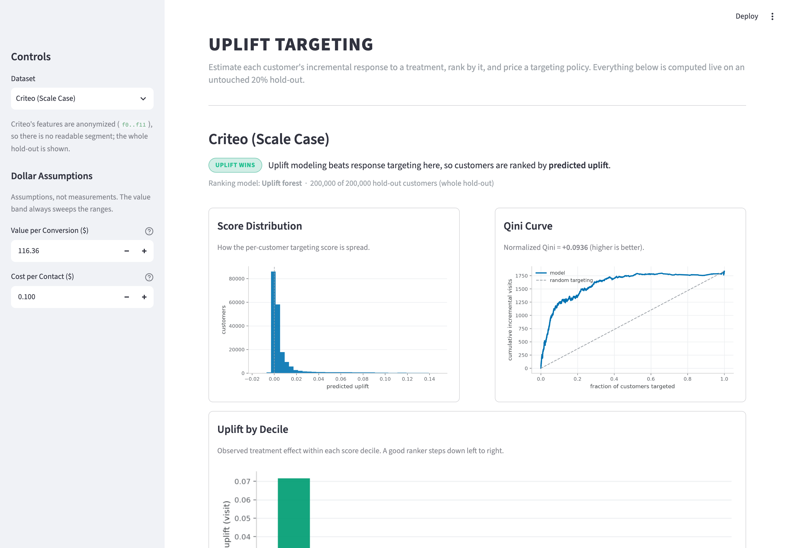
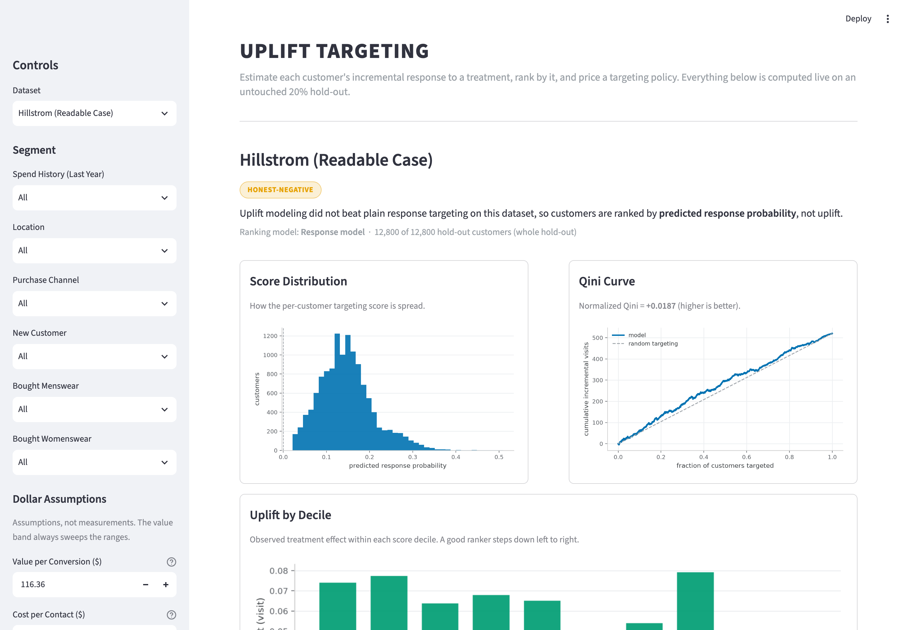
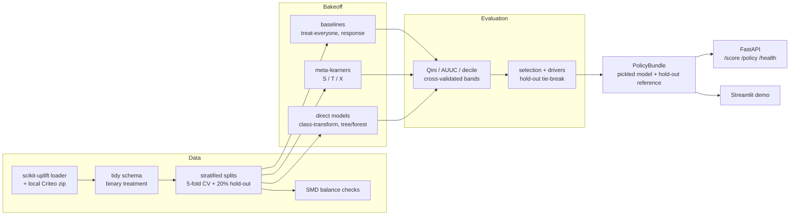

# Uplift Targeting

**Estimate the incremental effect of an action per customer, then turn that into a
targeting policy with a dollar value attached.**

Most models answer *what will happen* or *what is this*. A churn model tells you
who will leave; it does not tell you who stays **because** you intervened. Those
are different people, and the gap between them is where the budget goes. This
project lives in that gap: it is decision science, not prediction.

Given a randomized treatment, a control, and an outcome, it estimates the uplift
(the incremental effect of the treatment) for each individual, ranks people by
that uplift, and produces a spend policy — who to treat at a given budget, and
the projected incremental value of doing so. It ships as a reproducible pipeline,
a FastAPI service, and a live Streamlit demo.

> **Live demo:** **[uplift-targeting.streamlit.app](https://uplift-targeting-zpatkwkjfwqvnqdxpu9rzc.streamlit.app/)** — the same app you can run locally below.



---

## The headline finding

The whole project is a bakeoff with an honest scoreboard, and the result is the
kind you rarely see written down:

- On the **small, readable dataset (Hillstrom)**, uplift modeling **does not beat
  plain response targeting**. Every uplift model's cross-validated Qini has a
  standard deviation larger than its mean — statistically indistinguishable from
  zero. The chosen model there is the response baseline, labeled openly as a
  negative result.
- On the **large dataset (Criteo)**, uplift modeling **does win, but modestly**.
  The chosen model (a hand-rolled uplift forest) clears the response bar on
  cross-validated Qini with the tightest confidence band, and it is the only
  winner that also holds up on the untouched hold-out.

Uplift's edge over "just target the people most likely to respond" is real, but
it is slim, dataset-dependent, and split-sensitive. Saying that plainly is the
point. A model that quietly loses to a baseline, dressed up as a win, is the
failure mode this project is built to avoid.

## Results

Primary outcome is **visit**. Scores are out-of-fold from 5-fold stratified
cross-validation (seed 42); the headline is normalized Qini (0–1 scale, higher is
better) reported as **mean ± std across folds** — the std is the honest unit, not
a decoration. The **hold-out** column is a single unbiased number on the reserved
20% split, used only to break ties. Full field, both datasets:

### Criteo (scale case, 1M subsample)

| Model | Qini (5-fold CV) | Qini (hold-out) |
|---|---|---|
| treat_everyone | +0.0000 ± 0.0000 | +0.0000 |
| response_model *(baseline)* | +0.0877 ± 0.0074 | **+0.0973** |
| s_learner | +0.0927 ± 0.0110 | +0.0806 |
| t_learner | +0.0703 ± 0.0168 | +0.0626 |
| x_learner | +0.0729 ± 0.0145 | +0.0518 |
| class_transformation | +0.0776 ± 0.0049 | +0.0810 |
| uplift_tree | +0.0784 ± 0.0055 | +0.0876 |
| **uplift_forest** *(chosen)* | **+0.0905 ± 0.0067** | +0.0936 |

Only the s_learner (+0.0927) and the uplift_forest (+0.0905) beat the response
bar (+0.0877) on CV, and their bands overlap — a statistical tie. The rule breaks
it on stability: the forest has the tighter band **and** generalizes to the
hold-out, where the s_learner collapses. Honest caveat: even the forest's hold-out
Qini (+0.0936) sits just under the response baseline's (+0.0973) on that single
draw.

### Hillstrom (readable case, 64k customers)

| Model | Qini (5-fold CV) | Qini (hold-out) |
|---|---|---|
| treat_everyone | +0.0000 ± 0.0000 | +0.0000 |
| **response_model** *(chosen)* | **+0.0197 ± 0.0170** | +0.0187 |
| s_learner | +0.0088 ± 0.0174 | +0.0410 |
| t_learner | +0.0134 ± 0.0214 | +0.0282 |
| x_learner | +0.0085 ± 0.0168 | +0.0505 |
| class_transformation | +0.0061 ± 0.0167 | +0.0469 |
| uplift_tree | +0.0017 ± 0.0221 | +0.0417 |
| uplift_forest | +0.0129 ± 0.0155 | +0.0661 |

No uplift model clears the response bar on CV, and every one has std > mean. The
hold-out flips (uplift models swing above response), but a single 12.8k draw of a
high-variance metric cannot overturn a within-noise CV result. That disagreement
is exactly *why* the project bands every number.

<p align="center">
  
  
</p>

**Drivers (Criteo forest, permutation importance).** Feature `f0` dominates
(roughly 2× the next), then `f3`/`f6`/`f10`/`f8`. The features are anonymized, so
this names *which* feature drives uplift, not *what* it is.

Full write-up with all six figures: [`reports/phase8_report.md`](reports/phase8_report.md).

## From uplift to a priced policy

Ranking by uplift is only half the job. The value machinery turns a ranking and a
budget into a decision: target the top-*k* by predicted uplift, count the
incremental conversions off the conversion Qini curve, and price them.

Because value-per-conversion and cost-per-contact are **assumptions, not
measurements**, every dollar figure ships as a **range** that sweeps both — never
a single confident number. Example (Criteo, target the top 10% of the hold-out):

| Customers targeted | Incremental conversions | Net value (point) | Net value (band) |
|---|---|---|---|
| 20,000 | +23.8 | $767 | −$8,811 to $2,567 |

Point uses value $116.36 / conversion and $0.10 / contact; the band sweeps value
$50–$150 × cost $0.05–$0.50. The incremental-conversions figure is
assumption-free. Move the budget slider in the demo and the whole band updates
live.



## Architecture



Every layer is pure logic separated from I/O, unit-tested (130+ tests), and driven
by `uv run` commands. The evaluation harness (Qini/AUUC) is a from-scratch
reimplementation cross-checked against `scikit-uplift` to machine precision, so
the measuring stick is trusted before any model is judged by it.

## Repository layout

```
src/uplift/
  data/     loaders, tidy schema, stratified splits, SMD balance checks
  eval/     Qini / AUUC / decile / incremental-value harness + naive baselines
  models/   meta-learners (S/T/X), direct models (tree/forest, class-transform), selection
  api/      FastAPI service, policy bundles, in-process demo logic
app/        Streamlit demo UI
scripts/    phase runners (EDA, leaderboards, selection, model persistence)
tests/      unit tests (evaluation math and data transforms first)
reports/    EDA report, phase-8 report, leaderboards (CSV)
assets/     generated figures + demo screenshots
models/     persisted policy bundles (small demo artifacts committed; rest gitignored)
data/       raw and processed datasets (gitignored, regenerated from source)
```

## Getting started

```bash
uv sync            # provisions Python 3.12 and installs into .venv
uv run pytest      # 130+ unit tests
uv run ruff check  # lint (clean tree)
```

### Run the demo locally

```bash
uv run python scripts/phase9_persist.py    # build the policy bundles into models/
uv run streamlit run app/streamlit_app.py  # http://localhost:8501
```

The demo reads only `models/` — no processed data and no running API at demo time.
`?dataset=criteo` or `?dataset=hillstrom` deep-links a view.

### Run the API

```bash
uv run uvicorn uplift.api.app:app          # /health, /score, /policy
```

`/score` returns per-customer scores; `/policy` takes a budget (dollars), a count,
or a fraction plus optional value/cost overrides and returns the incremental-value
band with its assumptions echoed.

### Reproduce the full pipeline

```bash
uv run python -m uplift.data.ingest    # load, split, run balance checks  (Criteo needs its local zip)
uv run python scripts/phase4_eda.py    # EDA report + figures
uv run python scripts/phase6_meta.py   # meta-learner leaderboard
uv run python scripts/phase7_direct.py # direct-model leaderboard
uv run python scripts/phase8_eval.py   # full field, hold-out, selection, drivers
uv run python scripts/phase9_persist.py# persist the chosen policy bundles
```

Everything is seeded (42); the same command reproduces the same result.

## Deploy

The hosted demo runs on **Streamlit Community Cloud** (free tier), in-process over
the `uplift` library — one deployable process, no separate API to host. The repo
is deploy-ready:

- [`requirements.txt`](requirements.txt) installs the local package and its
  runtime dependencies for the pip-based cloud build.
- The small policy bundles under `models/` (~6 MB, public data only) are committed
  so the cloud app has them at startup — the Criteo bundle cannot be rebuilt in the
  cloud because its source download is no longer available.

To deploy your own copy: on [share.streamlit.io](https://share.streamlit.io), sign
in with GitHub, create a new app from this repo on branch `main` with main file
`app/streamlit_app.py` and Python 3.12, then deploy.

## Data

Both datasets are public, free, and carry a real randomized treatment/control
split, so there is no confounding to untangle. Each is third-party and governed by
its own original terms; both load through the
[`scikit-uplift`](https://www.uplift-modeling.com/) datasets loader for
reproducibility.

- **Hillstrom MineThatData Email Challenge** — 64k customers, randomized email arms
  (collapsed to one binary treatment), visit / conversion / spend outcomes. The
  small, readable case.
- **Criteo Uplift Prediction** — ~13M rows, 12 anonymized features, randomized
  treatment flag; subsampled to 1M (stratified, seed 42) for v1. The scale case.

A covariate-balance check (standardized mean difference per feature) runs before
any modeling; both datasets pass.

## Tech stack

Python 3.12, [`uv`](https://docs.astral.sh/uv/) for the environment and lockfile,
Ruff for lint and format, `pytest` for tests. Modeling is on **LightGBM**;
`scikit-uplift` supplies the reference metrics and dataset loaders. The
meta-learners, the uplift tree/forest, the class transformation, the
evaluation harness, and the explainability are all **hand-rolled** over
LightGBM/numpy rather than pulled from a heavy causal-ML dependency — the
dependency set stays small and every method is transparent and tested. Serving is
FastAPI + Uvicorn; the demo is Streamlit with matplotlib figures. Dependencies are
added phase by phase, as each is first used.

## Limitations

Lead with these — they are where the project earns its seniority.

- **No per-row ground truth.** You never see both outcomes for the same person, so
  uplift is never labeled at the row level. There is no per-customer error to
  report; all evaluation is aggregate.
- **Aggregate metrics are noisy.** Qini and AUUC have high variance and swing with
  the treated-to-control balance. Every headline number is a cross-validated band,
  not a point.
- **The honest negative is real.** On Hillstrom, uplift modeling does not beat
  response targeting. That finding is reported, not buried.
- **Bounded validity.** Estimates speak only to the population and the exact
  treatment that ran. Acting on the policy changes who gets targeted, so
  incremental value is an offline projection, never a promise.
- **The dollar figure rests on assumptions.** Value-per-conversion and
  cost-per-contact are inputs, not measurements, so incremental value ships as a
  range with the assumptions stated. The datasets are anonymized ad/marketing data,
  so this is a methodology demonstration, not a live retention system.

## Future work

- Observational causal inference (propensity weighting, DAGs) to lift the
  randomized-data restriction.
- Multi-arm and continuous treatments; the R-learner left optional in v1.
- A full-Criteo (13.98M-row) run to tighten the bands beyond the 1M subsample.
- Uplift on the rarer **conversion** outcome, not just visit.

## License

[MIT](LICENSE) © 2026 Hriday Saha. The datasets are third-party and remain under
their own respective licenses.

## Author

Hriday Saha
