# Phase 4 — Exploratory Data Analysis: who should we treat?

This is the internal, in-depth EDA for the uplift-targeting project. It is the raw
material for a future standalone blog on the EDA itself; it is not the blog. Every
number here is computed directly from the tidy processed data in `data/processed/`
by `scripts/phase4_eda.py`, which also regenerates every figure. Nothing is
invented, and the analysis never touches the processed data or the pipeline.

Two datasets carry the story throughout: the **Hillstrom** email experiment
(64,000 customers) and a **1,000,000-row subsample of the Criteo** uplift dataset
(drawn with seed 42; see the data notes, D18). Figures live in `assets/eda/` as
matching SVG (vector) and PNG (raster) pairs. Colours use the **Okabe–Ito**
palette, a colourblind-safe set, kept consistent across every figure; the one
heatmap uses the colourblind-safe **RdBu** diverging map centred on zero.

A note on units: an outcome rate is a share of people (a visit rate of 0.1468
means 14.68% of customers visited). A treatment effect is a **difference** of two
such rates, so it is naturally small. To keep those differences readable, effects
are often quoted in **percentage points (pp)**: +6.09 pp means the treated rate is
6.09 points higher than the control rate.

---

## 1. The question

The whole project answers one question: **who should we treat?** Not "who will
buy" — "who buys *because* we contacted them." Those are different people. Someone
who would have visited anyway is wasted budget; someone a nudge tips over is real
gain; and a few people a nudge actively pushes away are worse than doing nothing.
The quantity we want is **uplift**: the treated outcome minus the outcome that same
person would have had untreated.

We never see both outcomes for one person, so uplift is never labelled at the row
level. The only way to measure it honestly is a **randomized experiment**: split
people at random into treated and control, and the difference in their average
outcomes is a clean causal effect, with no confounding to untangle. That is
exactly what both datasets provide. This EDA checks two things before any modelling
starts — that the randomization holds, and that there is a real, measurable effect
worth targeting — and then asks whether that effect is the *same* for everyone or
*varies* by person. If it varies, targeting can beat treating everyone. If it does
not, the honest answer is to treat everyone, and we would say so.

---

## 2. Meet the data

**Question.** What are we actually working with — how many people, which features,
which arms, and which outcomes?

Both datasets are randomized experiments with a binary treatment (contacted vs
not) and binary outcomes. Hillstrom is small and readable, with named retail
features; Criteo is large and realistic, with twelve anonymized features.

| dataset | rows | treated | control | features | outcomes |
|---|---|---|---|---|---|
| Hillstrom | 64,000 | 42,694 (66.7%) | 21,306 (33.3%) | 8 named (recency, prior-year spend + band, mens/womens, zip, newbie, channel) | visit, conversion, spend |
| Criteo (1M) | 1,000,000 | 850,000 (85.0%) | 150,000 (15.0%) | 12 anonymized (`f0`–`f11`) | visit, conversion |

For Hillstrom the two original email arms (men's and women's) are collapsed into
one "treated" flag, so v1 is a single binary treatment. For Criteo the randomized
`treatment` flag is used as-is, and the post-treatment `exposure` flag is ignored
on purpose (conditioning on it would reintroduce confounding). `spend` exists only
in Hillstrom and is not a modelling target; it is used later to price a conversion.

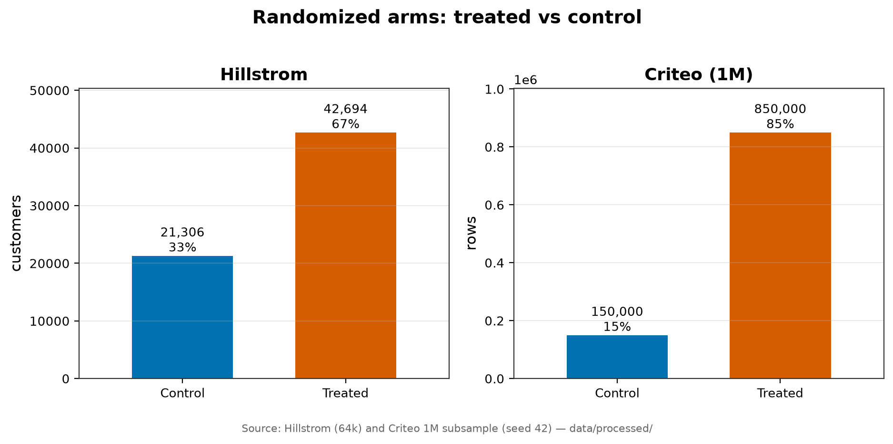

**Finding.** The arms are very differently sized. Hillstrom is a roughly 2:1
treated-to-control split; Criteo is a heavy ~85:15. Both are legitimate randomized
designs — an unequal split is a design choice, not a sign of bias (Section 3 tests
the actual randomness).

**Why it matters.** The 85/15 Criteo split means the control group, though large in
absolute terms (150,000 rows), is the scarce side. Every uplift metric compares
treated to control, so the control group is where the statistical noise is
smallest-but-still-binding. This is why the Qini curve needs the size correction
already specified in the evaluation design, and why we subsample carefully rather
than shrinking the control further.

---

## 3. Can we trust the experiment?

**Question.** Was the treatment really assigned at random? If treated and control
customers differ *before* any email, then any outcome gap could be those
pre-existing differences rather than the treatment, and the whole premise breaks.

The check is **covariate balance**. For every feature we compute the standardized
mean difference (SMD) between treated and control — the gap in means divided by the
pooled spread — so all features are on one comparable scale. Categorical features
are checked one level at a time. The usual rule of thumb flags any `|SMD| > 0.1` as
a meaningful imbalance.

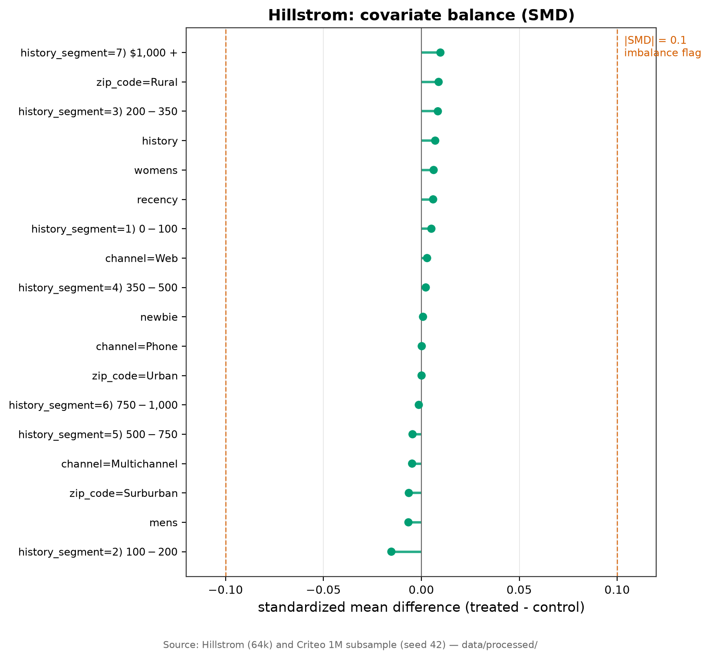

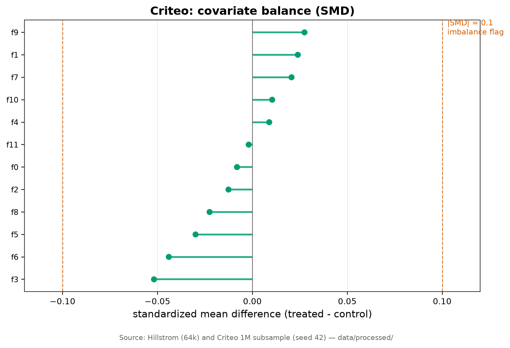

| dataset | covariates checked | flagged (\|SMD\| > 0.1) | largest \|SMD\| | worst covariate |
|---|---|---|---|---|
| Hillstrom | 18 (5 numeric + 13 category levels) | 0 | 0.0153 | `history_segment = $100–$200` |
| Criteo | 12 (`f0`–`f11`) | 0 | 0.0518 | `f3` |

**Finding.** Both experiments pass cleanly. Nothing comes close to the 0.1 line —
the worst single imbalance is 0.015 in Hillstrom and 0.052 in Criteo, both well
inside the "balanced" zone. Treated and control customers look the same before the
treatment.

**Why it matters.** This is the licence to interpret every outcome gap in this
report as a causal effect of the treatment, not a leftover difference between two
unlike groups. It is the foundation the rest of the analysis stands on. Criteo's
imbalances are uniformly larger than Hillstrom's (0.052 vs 0.015) — still tiny, but
a reminder that its features carry a little more treated/control wobble, worth a
glance again when its models are trained.

---

## 4. The rarity problem

**Question.** We have two outcomes, visit and conversion. How common is each, and
does that change which one we can model well?

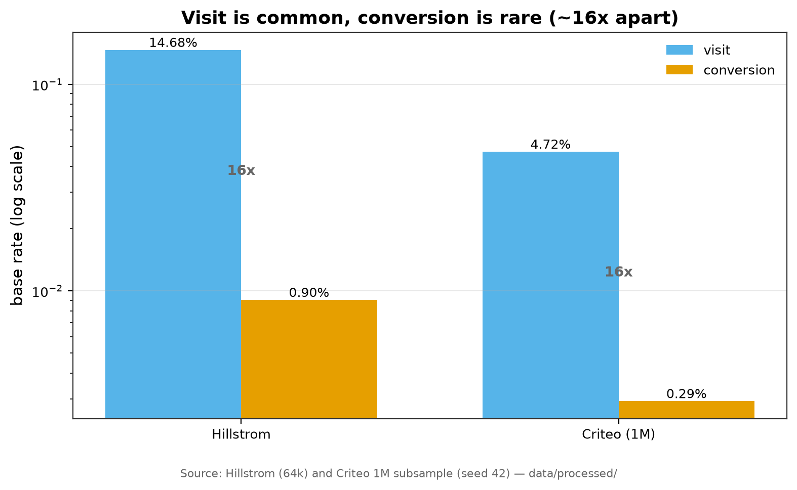

| dataset | visit rate | conversion rate | visit ÷ conversion |
|---|---|---|---|
| Hillstrom | 14.68% | 0.90% | 16.3× |
| Criteo (1M) | 4.72% | 0.29% | 16.2× |

**Finding.** In both datasets a **visit is about 16× more common than a
conversion**. Conversions are genuinely rare events — under 1% in Hillstrom and
about 1 in 340 in Criteo.

**Why it matters.** Uplift is a difference between two already-noisy rates. When the
underlying rate is under 1%, that difference sits on top of very few positive
examples, so its confidence interval is wide and a model can chase noise. Visit, at
5–15%, gives far more signal per row. This is the concrete, data-backed reason the
modelling treats **visit as the primary uplift target** and keeps **conversion as a
secondary outcome used mainly to attach a dollar value** — not because conversion
matters less to a business, but because the data can measure visit uplift reliably
and conversion uplift only roughly. Section 5 shows this gap in the confidence
intervals directly.

---

## 5. The average effect

**Question.** Does the treatment work *on average*? Before asking who responds, we
need to know there is an effect at all. The naive average treatment effect (ATE) is
simply the treated outcome rate minus the control rate, with a 95% confidence
interval from the normal approximation for a difference in proportions.

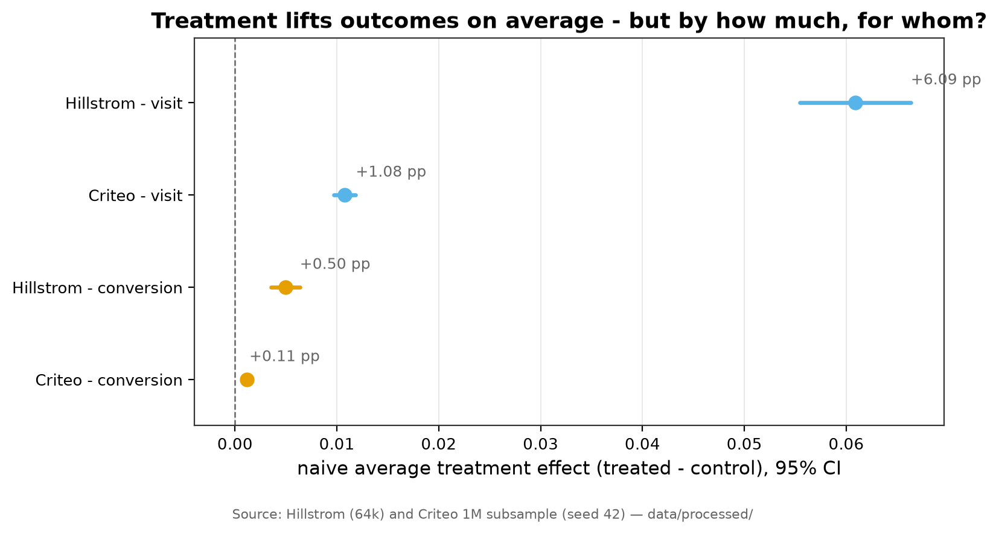

| dataset | outcome | treated | control | ATE (pp) | 95% CI (pp) |
|---|---|---|---|---|---|
| Hillstrom | visit | 16.71% | 10.62% | **+6.09** | [+5.54, +6.63] |
| Hillstrom | conversion | 1.07% | 0.57% | **+0.50** | [+0.36, +0.64] |
| Criteo (1M) | visit | 4.88% | 3.80% | **+1.08** | [+0.97, +1.19] |
| Criteo (1M) | conversion | 0.31% | 0.19% | **+0.11** | [+0.09, +0.14] |

**Finding.** Every effect is positive and every confidence interval sits clear of
zero, so the treatment genuinely lifts outcomes in both experiments. The size
differs sharply: Hillstrom's email is a strong nudge (+6.09 pp on visit, lifting
the visit rate by more than half), while Criteo's is a gentle one (+1.08 pp). The
conversion effects are real but small in absolute terms, and their intervals are
proportionally much wider — Hillstrom's +0.50 pp conversion effect has a CI half as
wide again as its point value, exactly the rarity problem from Section 4 showing up
as uncertainty.

**Why it matters.** There is a real average effect to work with — the project is not
built on sand. But an average is a single number laid over every customer, and it
quietly assumes the treatment helps everyone equally. It almost never does. The
average is the bar the targeting models must beat: if uplift is the same for
everyone, ranking people by it is pointless and "treat everyone" wins. The rest of
the report asks whether the effect is flat or varies — because only variation makes
targeting worth doing.

---

## 6. Who responds — the core of it

**Question.** Is the treatment effect the same for everyone, or does it concentrate
in some kinds of customer? This is the crux. If uplift varies across slices of the
data, then a model that finds the high-uplift people can beat treating everyone at
the same budget. If it is flat, targeting has nothing to grab.

For each slice we compute the visit uplift (treated rate − control rate) *within*
that slice, with a 95% CI. The dashed line marks the overall +6.09 pp effect; bars
or points above it are slices where the email works harder than average.

### Hillstrom: named slices

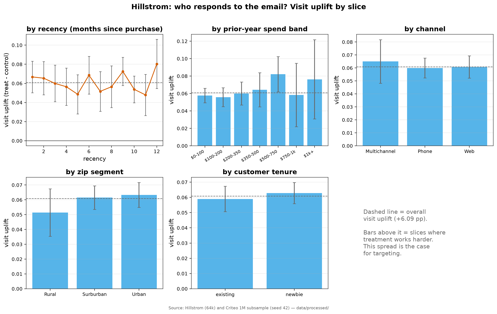

**Finding.** The effect is clearly not flat, and prior spending is the strongest
signal. Sorting customers into ten equal groups by prior-year spend, visit uplift
climbs from **+5.04 pp** in the lowest-spend decile to **+7.84 pp** in the
highest — the email moves past buyers more than it moves quiet ones. The
spend-*band* view tells the same story, peaking at **+8.22 pp** for the $500–$750
band, though the top two bands hold few customers and their intervals blow out.
The softer signals: **Urban and Suburban** customers respond a little more than
**Rural** (+6.3 / +6.2 vs +5.2 pp, and Rural's interval is wide); **newbies** edge
out existing customers (+6.3 vs +5.9 pp) but the intervals overlap; **channel**
barely moves the needle (Phone +6.0, Web +6.1, Multichannel +6.5 pp). Recency is
noisy with no clean trend across the twelve months (slice effects swing between
+4.8 and +8.0 pp).

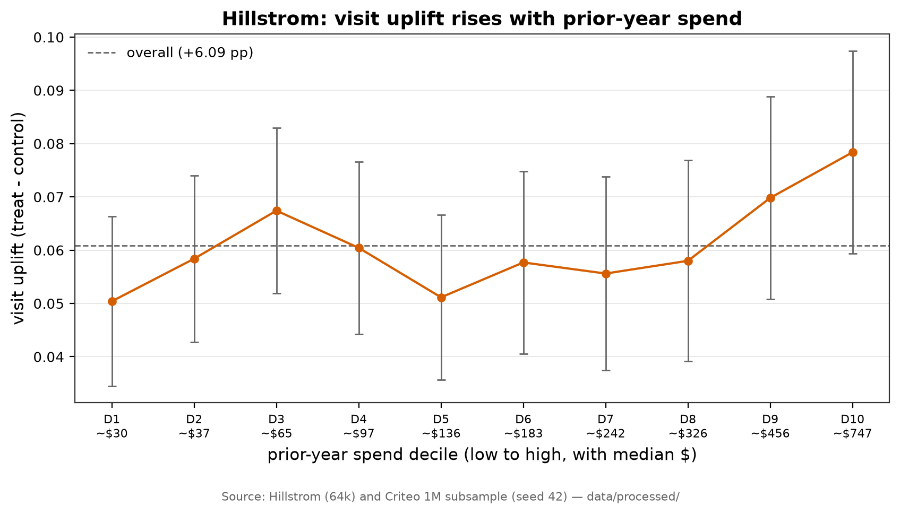

The spend-decile figure isolates that cleanest signal: a broadly rising line from
low to high spenders. It is not perfectly monotone — the middle deciles wobble
within their error bars — but the direction is consistent and the endpoints differ
by about 2.8 pp, which is real next to their intervals.

### Criteo: anonymized features

For Criteo we have no names, so we bin each of the twelve features into deciles and
measure visit uplift in each decile. The heatmap shows all twelve features at once;
red means the treatment helps more in that decile.

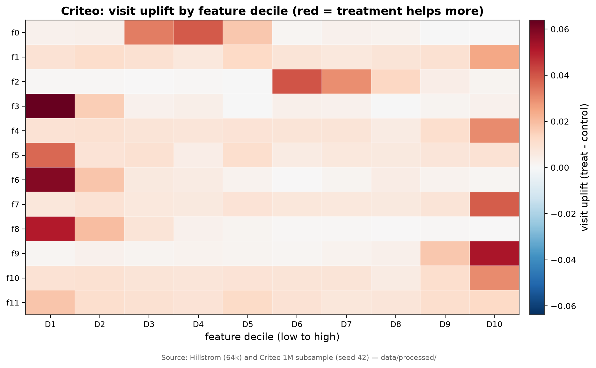

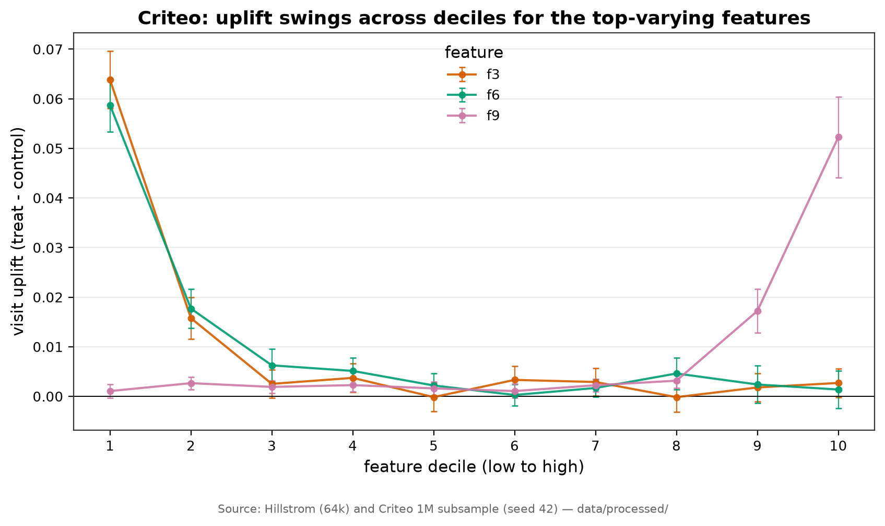

**Finding.** Uplift varies a lot from cell to cell — far more than Criteo's flat
+1.08 pp average suggests. Some feature deciles carry six times the average effect:
`f3`'s lowest decile shows **+6.38 pp**, `f6`'s lowest **+5.87 pp**, and `f9`'s
*highest* decile **+5.22 pp**, against roughly zero in their other deciles. The
structure differs by feature — for `f3`, `f6`, `f8` the action is at the low end,
for `f9` at the high end — which is exactly the kind of interaction a tree-based
uplift model can exploit. One honest caveat: of the 120 decile cells, only 4 dip
below zero and only barely (the most negative is −0.02 pp). So at this coarse
decile view there is **no clear "sleeping dog" signal** — customers the treatment
actively pushes away — in Criteo visits. The variation is in *how much* the
treatment helps, not in whether it flips to harm.

**Why it matters.** This is the evidence that targeting can beat treat-everyone.
Both datasets show real, sliceable variation in who responds, and in Hillstrom it
lines up with an interpretable driver (prior spend). That variation is precisely
what the uplift models in later phases are built to find and rank. It also sets
expectations: Hillstrom should yield a readable, defensible targeting story;
Criteo has exploitable structure but no human-readable feature names, so its story
will be "the model found signal here" rather than "past buyers respond more." And
the near-absence of negative-uplift cells warns that the hardest, most valuable
part of uplift modelling — reliably spotting people to *not* contact — may have
little to grab onto in this public data.

---

## 7. The value angle

**Question.** When a conversion happens, what is it worth? The whole dollar side of
the project — incremental value at a budget — needs a value-per-conversion number,
and Phase 2 left it as a provisional $100 placeholder to confirm here.

The honest anchor is the **average order value among customers who actually
converted**: the mean of Hillstrom `spend` over the rows where `conversion = 1`.

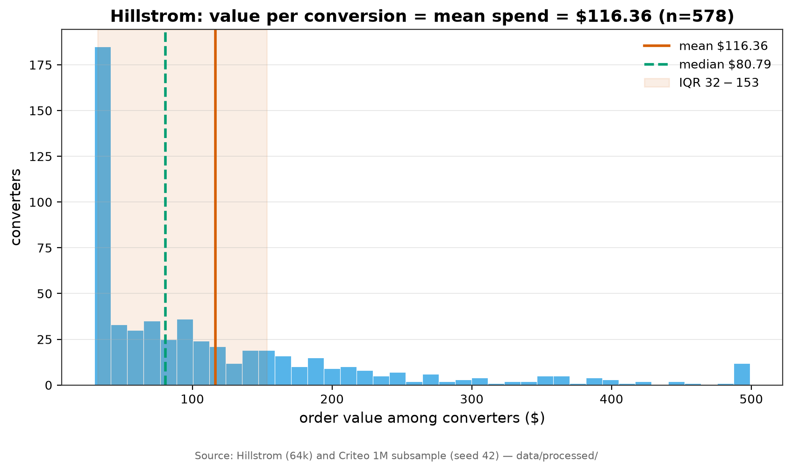

**Finding.** Among the **578** Hillstrom converters, spend averages **$116.36**
(95% CI [$107.57, $125.16]). The distribution is right-skewed: the median order is
only **$80.79**, the middle half (IQR) runs **$32.27–$153.35**, and orders range
from **$29.99** to a capped **$499.00**. The mean sits above the median because a
tail of large orders pulls it up.

**Why it matters.** This confirms and replaces the Phase 2 assumption. The
**value-per-conversion anchor is $116.36**, not the provisional $100 — recorded in
the decision log (D20) as the number to use going forward. Because the distribution
is skewed and rests on only 578 orders, the dollar figures the project reports must
stay a **range, never a single confident number**: we keep the $50–$150 sensitivity
band (it brackets the mean and most of the IQR) and simply re-anchor its centre to
$116.36. This is the input to the incremental-value calculation in the evaluation
harness, and it is deliberately framed as an assumption with a stated spread.

---

## 8. Data quality

**Question.** Is the processed data clean enough to model on, or are there missing
values, impossible rows, or oddities that would silently corrupt results?

**Findings, plainly.**

- **No missing values.** Zero nulls across all 64,000 Hillstrom rows and all
  1,000,000 Criteo rows. Nothing to impute.
- **Outcomes are internally consistent.** Every converter also visited (0 rows with
  `conversion = 1` but `visit = 0` in either dataset), and in Hillstrom `spend > 0`
  holds exactly when `conversion = 1` (0 violations either way). The outcome
  hierarchy visit ⊇ conversion ⊇ spend is respected, so there is no leakage or
  contradiction to clean.
- **Class imbalance is the real "quality" issue**, and it is the rarity from
  Section 4: conversions are under 1%. It is a property of the problem, not a
  defect, but it drives every downstream choice — stratified splits, size-corrected
  Qini, and the visit-primary decision.
- **Hillstrom values look sane.** Recency spans 1–12 months; prior-year spend runs
  up to $3,345.93 and is heavily right-skewed (see below), which is normal retail
  shape, not an error.
- **One cosmetic oddity:** the `zip_code` category `Surburban` is misspelled in the
  raw source and is kept verbatim for fidelity. It is a label, never a number, so
  it affects nothing but the eye.

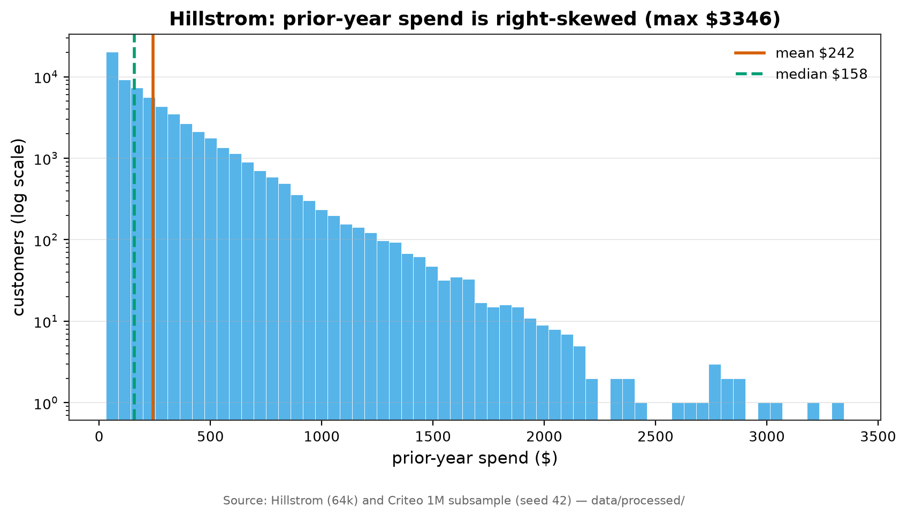

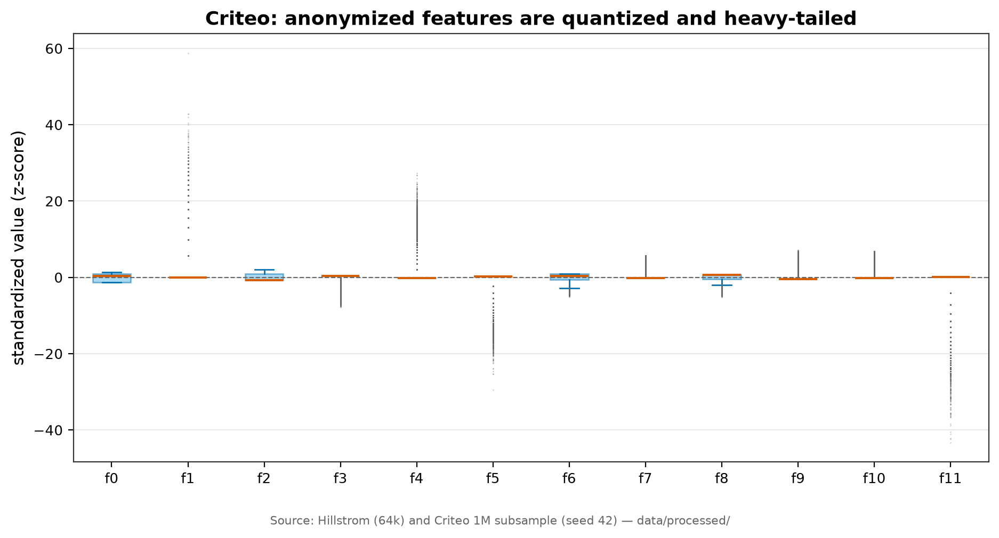

**Criteo's features need care.** Standardizing `f0`–`f11` and boxplotting them shows
two things: the features are **quantized** (many rows share identical values, so the
boxes are thin and medians sit flat) and **heavy-tailed** (extreme outliers reach
roughly +59 standard deviations on `f1`, +25 on `f4`, and about −40 on `f11`). They
are already numeric and finite, so nothing blocks modelling, but the fat tails mean
a tree-based learner (which splits on rank, not magnitude) is a safer default than
anything that assumes well-behaved, scaled inputs.

**Why it matters.** The data is unusually clean, so modelling effort goes into the
method, not into repair. The two things to carry forward are the class imbalance
(handled by the split and metric design) and Criteo's quantized, heavy-tailed
features (handled by preferring rank-based, tree-friendly learners).

---

## 9. Takeaways into modelling

What this EDA settles, and hands to the phases ahead:

1. **The premise holds.** Both experiments are balanced (max |SMD| 0.015 / 0.052,
   nothing flagged), so every effect is causal. There is a real average effect to
   target (visit +6.09 pp Hillstrom, +1.08 pp Criteo, both clear of zero).
2. **Target visit, price with conversion.** Visit is ~16× more common than
   conversion in both datasets, giving it the signal for stable uplift; conversion
   is too rare to rank reliably and is kept for the dollar figure. The confidence
   intervals in Section 5 back this quantitatively.
3. **Targeting has something to find.** Uplift varies across slices in both
   datasets. In Hillstrom it tracks an interpretable driver — prior-year spend
   (+5.0 pp low decile → +7.8 pp high) — plus softer geography and tenure signals.
   In Criteo, specific feature deciles carry up to +6.4 pp against a +1.1 pp
   average, structure a tree model can exploit.
4. **Value-per-conversion is confirmed at $116.36** (95% CI [$108, $125]; skewed,
   n = 578), superseding the $100 placeholder. Dollar results ship as a range with
   the $50–$150 sensitivity band re-centred here.
5. **The honest risks, stated up front.**
   - *Thin conversion signal.* Under-1% base rates make conversion uplift noisy;
     lean on visit and treat conversion-based dollars as indicative.
   - *No sleeping-dog signal in Criteo.* At the decile view essentially no cell
     shows negative uplift, so the most valuable uplift trick — finding people to
     *not* contact — may have little to grab in this public data. A likely honest
     negative result, and that is a legitimate finding, not a failure.
   - *Anonymized Criteo features.* `f0`–`f11` have no meaning, so Criteo yields a
     "the model found signal" story, never a "these customers respond because…"
     story. Hillstrom carries the readable narrative.
   - *Criteo features are quantized and heavy-tailed*, favouring rank-based,
     tree-friendly learners over scale-sensitive ones.

The next phase builds the evaluation harness (Qini / AUUC / uplift-by-decile /
incremental value) and the two naive baselines — the measuring stick that every
uplift model in the bakeoff must beat, built before any model is fitted.

---

*Reproduce every figure and number in this report:*

```bash
uv run python scripts/phase4_eda.py
```
