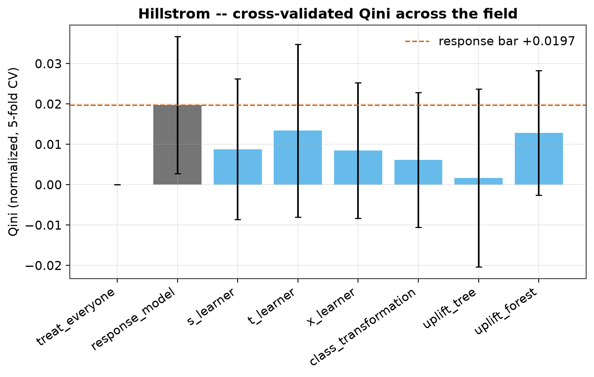
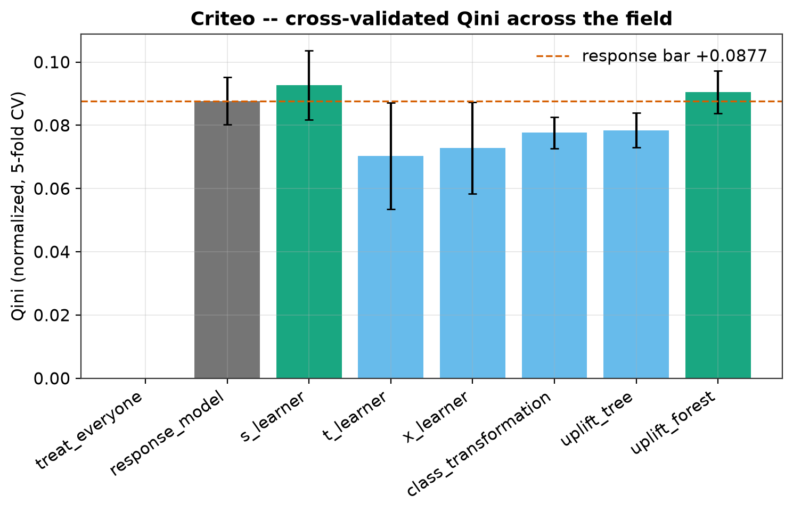
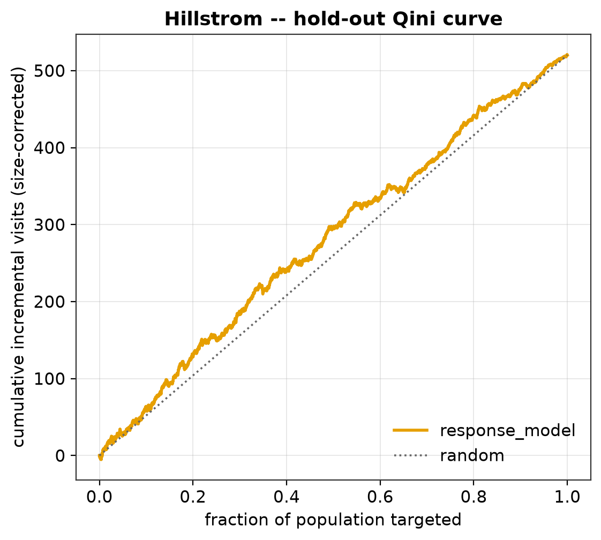
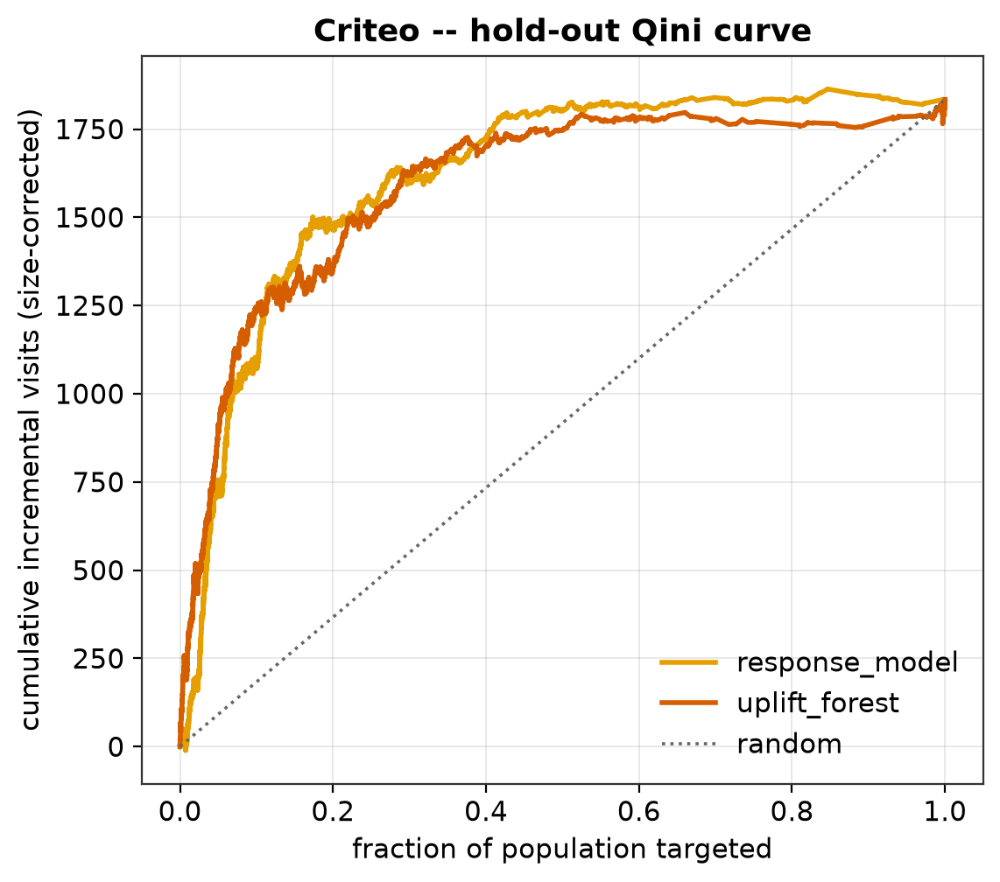
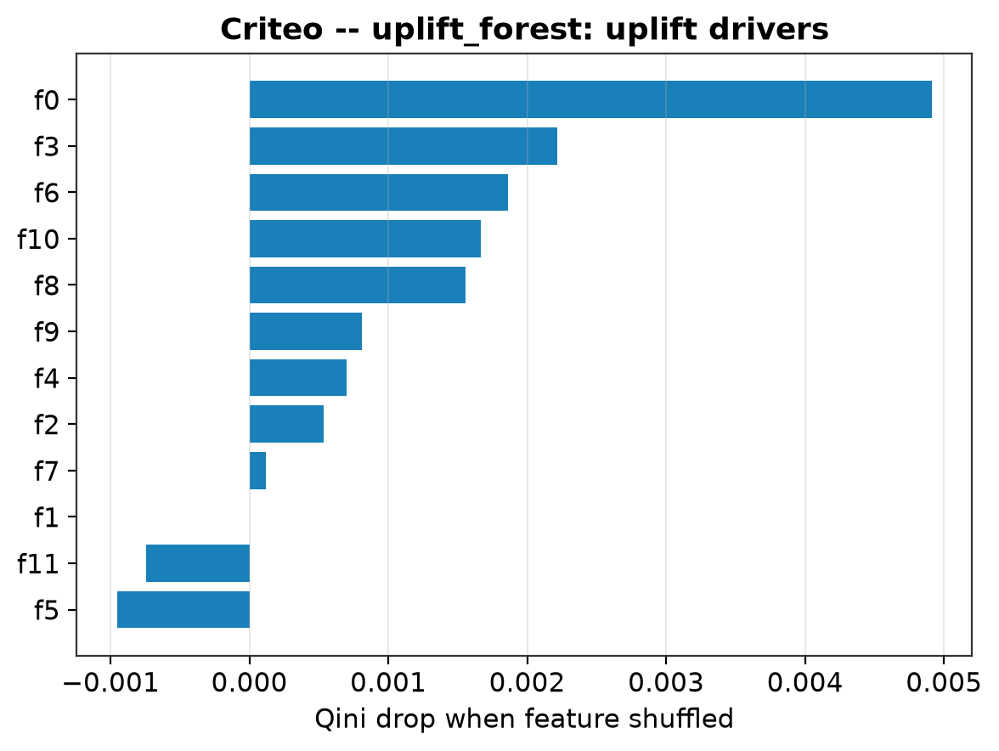
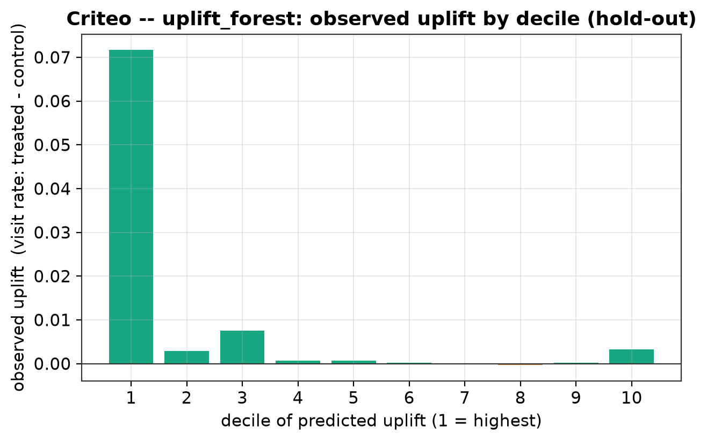

# Phase 8 — Evaluation, selection, explainability: the bakeoff verdict

This phase closes the bakeoff. Eight models — two naive baselines, three
meta-learners, three direct uplift models — are put on one cross-validated
leaderboard per dataset, confirmed once on an untouched hold-out, and judged by a
single rule. Then the chosen model's uplift drivers are named. The dollar-value
figure is deliberately **not** here; it ships with the Phase 9 `/policy` endpoint.

Everything below is reproduced by a single command over the processed data:

```
uv run python scripts/phase8_eval.py
```

Artifacts: `reports/phase8_leaderboard.csv` (CV bands), `reports/phase8_holdout.csv`
(hold-out), `reports/phase8_drivers_criteo.csv` (drivers), and the figures in
`assets/phase8/` (SVG + PNG).

---

## 1. What this settles

- **Hillstrom (small, readable): honest-negative.** No uplift model beats the plain
  response baseline on cross-validation. Every uplift model's fold-to-fold spread is
  wider than its own mean, so their Qini is not distinguishable from zero. Targeting
  the likely responders is as good as anything here.
- **Criteo (large, realistic): a modest, non-robust positive.** Two uplift models
  clear the response bar on cross-validation — the S-learner and the uplift forest —
  but only by a slim, band-overlapping margin. The forest is chosen as the more
  stable of the two. On the single hold-out draw the response baseline actually edges
  ahead, so uplift's advantage is real on average but not confirmed out-of-sample.

The one-line honest headline: **uplift modeling's edge over ordinary response
targeting is small, dataset-dependent, and sensitive to the evaluation split.** That
is the result the project set out to report honestly, not a number to oversell.

---

## 2. How the winner is chosen

**The field (8 models).** Baselines `treat_everyone` and `response_model`;
meta-learners `s_learner`, `t_learner`, `x_learner`; direct models
`class_transformation`, `uplift_tree`, `uplift_forest`.

**Cross-validated Qini (the headline).** 5-fold stratified CV, seed 42. Every row is
scored out-of-fold — the model that scores a fold never trained on it — and the
metric is reported as the mean ± std **across folds**. Qini is high-variance, so the
band is the honest unit, not the point. AUUC is reported alongside and tracks Qini
throughout; we lead with Qini. The 20% hold-out is excluded from all CV numbers.

**Hold-out confirmation.** Each model is then fit on the whole dev set and scored
**once** on the 20% hold-out it has never seen — a single unbiased number, the
tie-break basis.

**The rule (from MODELING.md).** A model must beat *both* baselines on CV Qini to
count. Among those that do, the highest CV Qini wins; when the top bands overlap the
tie breaks on **stability** (tighter band) first, then **interpretability**. If
nothing beats the response bar, the response baseline "wins" and that is recorded as
the honest-negative finding.

---

## 3. The field — cross-validated leaderboard

### Hillstrom (dev = 51,200 rows; visit base rate ~14.6%)

| model | Qini (norm) | AUUC (norm) |
|---|---|---|
| treat_everyone | +0.0000 ± 0.0000 | +0.0000 ± 0.0000 |
| **response_model** | **+0.0197 ± 0.0170** | **+0.0111 ± 0.0099** |
| s_learner | +0.0088 ± 0.0174 | +0.0049 ± 0.0098 |
| t_learner | +0.0134 ± 0.0214 | +0.0074 ± 0.0122 |
| x_learner | +0.0085 ± 0.0168 | +0.0049 ± 0.0096 |
| class_transformation | +0.0061 ± 0.0167 | +0.0035 ± 0.0099 |
| uplift_tree | +0.0017 ± 0.0221 | +0.0009 ± 0.0123 |
| uplift_forest | +0.0129 ± 0.0155 | +0.0072 ± 0.0090 |



The response baseline is the tallest bar, and **every uplift model has a std larger
than its mean** — the error bars all straddle zero. On 51k development rows the visit
uplift signal is too thin to model. This is the negative result PROJECT.md
anticipated, and it is not a bug: it is what a small dataset with a ~6-point average
effect and a ~15% base rate gives you.

### Criteo (dev = 800,000 rows; visit base rate ~4.7%)

| model | Qini (norm) | AUUC (norm) |
|---|---|---|
| treat_everyone | +0.0000 ± 0.0000 | +0.0000 ± 0.0000 |
| response_model | +0.0877 ± 0.0074 | +0.0345 ± 0.0030 |
| s_learner | +0.0927 ± 0.0110 | +0.0364 ± 0.0044 |
| t_learner | +0.0703 ± 0.0168 | +0.0275 ± 0.0067 |
| x_learner | +0.0729 ± 0.0145 | +0.0286 ± 0.0058 |
| class_transformation | +0.0776 ± 0.0049 | +0.0304 ± 0.0019 |
| uplift_tree | +0.0784 ± 0.0055 | +0.0307 ± 0.0022 |
| **uplift_forest** | **+0.0905 ± 0.0067** | **+0.0355 ± 0.0027** |



Only two models clear the response bar (+0.0877): the **s_learner (+0.0927)** and the
**uplift_forest (+0.0905)**, both with bands that overlap the bar. `class_transformation`
(+0.0776) and `uplift_tree` (+0.0784) land just below it; `t_learner` and `x_learner`
sit well under. The two-model shortlist matches the separate Phase 6 and Phase 7
readings exactly (a machinery check: the baselines reproduce their earlier numbers to
the digit).

---

## 4. The hold-out, and why the band matters

Scored once on the reserved 20% (Hillstrom n = 12,800; Criteo n = 200,000):

| model | Hillstrom hold-out Qini | Criteo hold-out Qini |
|---|---|---|
| treat_everyone | +0.0000 | +0.0000 |
| response_model | +0.0187 | **+0.0973** |
| s_learner | +0.0410 | +0.0806 |
| t_learner | +0.0282 | +0.0626 |
| x_learner | +0.0505 | +0.0518 |
| class_transformation | +0.0469 | +0.0810 |
| uplift_tree | +0.0417 | +0.0876 |
| uplift_forest | +0.0661 | +0.0936 |



**The Hillstrom hold-out disagrees with its own CV.** The figure shows the chosen
response model hugging the random diagonal — a weak ranker, as expected. Yet in the
table above, the uplift models *swing above* it on this one draw (the forest posts
+0.0661 vs response's +0.0187), the reverse of the CV order. This is not a hidden win;
it is the whole reason we band. One 12,800-row draw of a high-variance metric swings
wildly, and a CV result where every uplift model sits inside the noise cannot be
overturned by a single lucky split. The honest reading stays: negative on Hillstrom.



**The Criteo hold-out tells the cautionary half of the story.** On this one draw the
*response baseline* scores highest (+0.0973), with the uplift forest a close second
(+0.0936) and the CV-leading s_learner collapsing to +0.0806. So the uplift edge that
CV finds does not reproduce on the hold-out — a plain reminder that the advantage is
small enough to vanish under sampling noise.

---

## 5. The verdict

**Hillstrom → `response_model` (honest-negative).** No uplift model clears the CV bar.
The right decision here is to *not* deploy an uplift model: target the likely
responders. Because that "winner" is a response model, not an uplift model, there is
no uplift model to explain on Hillstrom — SHAP on the response classifier would
explain *response*, not *incrementality*, which is the wrong question.

**Criteo → `uplift_forest` (chosen), with the S-learner a genuine near-tie.** The
s_learner has the higher CV mean (+0.0927 vs +0.0905), but the gap (0.0022) is a
fraction of either band, so the two are a statistical tie and the rule breaks it on
stability. The forest is the more stable model on both counts that matter:

- **Tightest CV band** of the two (std 0.0067 vs 0.0110).
- **Generalizes** — it holds +0.0936 on the hold-out, while the CV-leading s_learner
  drops to +0.0806 (the largest CV-to-hold-out fall in the field).

So the forest is the robust choice, and it is what we carry into serving. We record
the trade honestly: the s_learner is the *interpretable* near-tie (a LightGBM model,
directly TreeSHAP-able), and Phase 9 may prefer it for serving on those grounds. The
forest wins the bakeoff on the documented rule; interpretability is the runner-up's
consolation, noted, not buried.

---

## 6. What drives uplift on Criteo

The chosen forest is hand-rolled over numpy, so no tree explainer can read it; drivers
come from **permutation importance** — shuffle a feature, measure how far the model's
Qini falls (bigger fall = the model leans on it more to rank uplift). This is the
model-agnostic, honest view for the actual winner.



| feature | Qini drop when shuffled |
|---|---|
| f0 | 0.0049 |
| f3 | 0.0022 |
| f6 | 0.0019 |
| f10 | 0.0017 |
| f8 | 0.0016 |
| f9 / f4 / f2 | ~0.0005–0.0008 |
| f1 | 0.0000 (unused) |
| f5 / f11 | slightly negative |

**`f0` dominates** — shuffling it hurts Qini more than twice as much as the next
feature — with `f3`, `f6`, `f10`, `f8` a secondary tier. `f1` carries no ranking
signal; `f5` and `f11` are mildly *negative* (the model would rank marginally better
without them — pure noise the forest slightly over-fits). Criteo's features are
anonymized floats, so this names *which* signals drive uplift, not *what* they are —
the honest ceiling on interpretability for this dataset.



The decile chart is the sanity check on the ranking: sort the hold-out by predicted
uplift, split into ten equal bins, and plot the *observed* treated-minus-control visit
rate per bin. It is a strong result — the **top decile shows about 7 points of
observed visit uplift against the ~1.1-point population average**, roughly a sixfold
concentration, and the observed uplift falls to near zero below it. The forest's
ranking puts the incremental visits where they belong: at the top. The profile is not
perfectly monotone (a small positive bump returns at decile 10) — the expected noise
from estimating a ~1-point effect on a 4.7% base rate — but the top-decile signal is
unambiguous.

**On explainability and dependencies.** SHAP was planned via the `shap` package, but
its `numba` requirement cannot build on this environment's bleeding-edge numpy
(2.5.1) under Python 3.12. LightGBM computes exact TreeSHAP itself through
`pred_contrib` — the same algorithm `shap.TreeExplainer` delegates to for LightGBM —
so for a LightGBM-backed winner (S-learner, class-transformation) we would read
identical values with no new dependency. The forest needed permutation importance
regardless, so this phase adds **no new dependency** (see DECISIONS D26).

---

## 7. Honest baseline comparison and limitations

- **The bar was the response model, and it is a hard bar.** On Hillstrom nothing beats
  it; on Criteo only two of six uplift models do, slimly. "Target the likely
  responders" is a strong, cheap default, and this bakeoff says so plainly.
- **No per-row ground truth.** Uplift is never labeled per customer, so every number
  here is aggregate. There is no per-row error to report — by the nature of the
  problem, not a gap in the build.
- **Qini is noisy.** The CV-vs-hold-out disagreement on *both* datasets is the direct
  evidence. We report bands and treat single draws with suspicion.
- **Bounded validity.** Estimates speak only to these populations and these exact
  randomized treatments. Acting on the policy changes who is targeted, so any
  projected value (Phase 9) is an offline projection, never a promise.
- **Anonymized features** cap Criteo interpretability at "which feature," not "what it
  means."

---

## 8. Reproduce

```
uv run python scripts/phase8_eval.py                 # both datasets (~5 min)
uv run python scripts/phase8_eval.py --datasets hillstrom   # fast case (~90 s)
uv run pytest tests/test_selection.py tests/test_explain.py # the new machinery
```

Wall time: Hillstrom ~88 s, Criteo ~198 s. Outputs: the two leaderboard CSVs, the
drivers CSV, and six figures in `assets/phase8/`. No processed data is modified.
